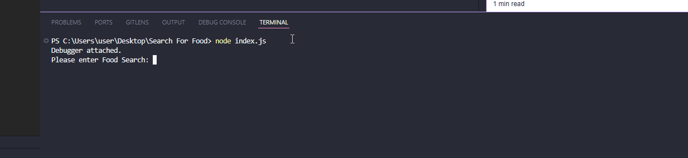

# Search For Food Readme

#### Overwiew
This application produces unique groupings of words entered by the user, words are grouped together by cities, brands, dish types and diets.
I have utilized the Prisma ORM for easier database management and data retrieval. The application runs in a vanilla Node.js project.

#### Installation Steps

###### Install the project with all of its dependencies.

1. Clone the Github repository
2. open the terminal window, navigate to the project in the terminal and run the following command.

`npm install`

###### Postgres Database Setup

1. make sure that you have installed postgresSQL
2. create a .env file inside the root of the project, copy and paste the following code into the .env file.
`DATABASE_URL="postgresql://<yourUsername>:<yourpassword>@localhost:5432/FoodSearch?schema=public"`
3. Replace the `<yourUsername>` and `<yourPassword>` tags with your postgres credentials.
4. Also check that your port and host is configured, the example contains the default postgres settings
5. Save the .env file

##### Create Database Structure

Please run the following command in your terminal, this will automatically  create the database for you

`npx prisma migrate dev --name init`

##### Database Seeding

Now we need to seed the database with test data, the following command will seed the database with some sample data

`node prisma/seed.js`

##### Run the application

Last but not least, we need to start the application
run the follwing command to start the application

`node index.js`

